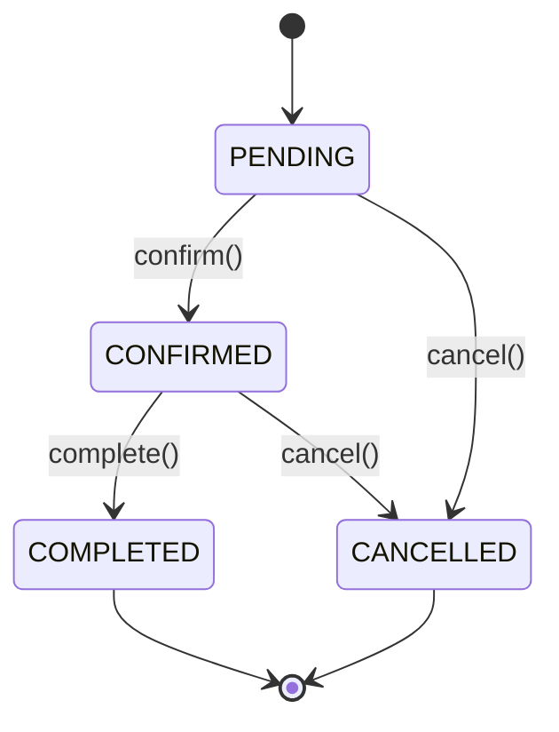

# 📊 BIỂU ĐỒ TRẠNG THÁI CẦN VẼ CHO DỰ ÁN PHONECOM

## 🎯 TỔNG QUAN

**Số lượng biểu đồ trạng thái cần vẽ: 4 biểu đồ**

---

## 📋 DANH SÁCH BIỂU ĐỒ TRẠNG THÁI

### **1. BIỂU ĐỒ TRẠNG THÁI ĐƠN HÀNG (Order State Machine)**
**Mức độ quan trọng:** ⭐⭐⭐⭐⭐ (QUAN TRỌNG NHẤT)

**Các trạng thái:**
- `PENDING` - Đơn hàng mới tạo, chờ xử lý
- `CONFIRMED` - Staff đã xác nhận, đã trừ tồn kho
- `COMPLETED` - Đã giao hàng thành công
- `CANCELLED` - Đã hủy (bởi user hoặc staff)

**Các chuyển đổi:**
```
PENDING → CONFIRMED (Staff confirm)
PENDING → CANCELLED (User/Staff cancel)
CONFIRMED → COMPLETED (Staff mark as delivered)
CONFIRMED → CANCELLED (Staff cancel after confirm)
```

**Events/Actions:**
- `confirm()` - Staff xác nhận đơn hàng
- `complete()` - Staff đánh dấu đã giao
- `cancel()` - User/Staff hủy đơn hàng

**Mô tả:**
- Đây là workflow chính của hệ thống e-commerce
- Có logic nghiệp vụ phức tạp (trừ tồn kho khi CONFIRMED)
- Có audit trail (timestamps: confirmedAt, completedAt, cancelledAt)

---

### **2. BIỂU ĐỒ TRẠNG THÁI GIỎ HÀNG (Cart State Machine)**
**Mức độ quan trọng:** ⭐⭐⭐⭐

**Các trạng thái:**
- `EMPTY` - Giỏ hàng trống
- `HAS_ITEMS` - Có sản phẩm trong giỏ
- `CHECKOUT` - Đang trong quá trình checkout
- `ORDERED` - Đã tạo đơn hàng (giỏ hàng được clear)

**Các chuyển đổi:**
```
EMPTY → HAS_ITEMS (User add item)
HAS_ITEMS → HAS_ITEMS (User add/update/remove items)
HAS_ITEMS → CHECKOUT (User click checkout)
CHECKOUT → ORDERED (User place order)
CHECKOUT → HAS_ITEMS (User cancel checkout)
ORDERED → EMPTY (Order created, cart cleared)
```

**Events/Actions:**
- `addItem()` - Thêm sản phẩm vào giỏ
- `updateQuantity()` - Cập nhật số lượng
- `removeItem()` - Xóa sản phẩm
- `startCheckout()` - Bắt đầu checkout
- `placeOrder()` - Đặt hàng
- `cancelCheckout()` - Hủy checkout

**Mô tả:**
- Workflow mua hàng của customer
- Có validation (check stock khi checkout)
- Cart được clear sau khi tạo order

---

### **3. BIỂU ĐỒ TRẠNG THÁI TỒN KHO VARIANT (Variant Stock Status)**
**Mức độ quan trọng:** ⭐⭐⭐⭐

**Các trạng thái:**
- `IN_STOCK` - Còn hàng (stockQuantity > 0)
- `OUT_OF_STOCK` - Hết hàng (stockQuantity = 0)
- `LOW_STOCK` - Sắp hết (stockQuantity < threshold, có thể thêm)

**Các chuyển đổi:**
```
IN_STOCK → OUT_OF_STOCK (Stock = 0 sau khi bán)
OUT_OF_STOCK → IN_STOCK (Restock)
IN_STOCK → LOW_STOCK (Stock < threshold)
LOW_STOCK → IN_STOCK (Restock)
LOW_STOCK → OUT_OF_STOCK (Stock = 0)
```

**Events/Actions:**
- `sell(quantity)` - Bán hàng (giảm stock)
- `restock(quantity)` - Nhập hàng (tăng stock)
- `adjust(quantity)` - Điều chỉnh tồn kho

**Mô tả:**
- Quản lý tồn kho tự động
- Status được update dựa trên stockQuantity
- Có inventory transactions để audit

---

### **4. BIỂU ĐỒ TRẠNG THÁI SẢN PHẨM (Product Lifecycle)**
**Mức độ quan trọng:** ⭐⭐⭐

**Các trạng thái:**
- `ACTIVE` - Sản phẩm đang bán
- `INACTIVE` - Sản phẩm tạm ngừng bán
- `DISCONTINUED` - Sản phẩm ngừng kinh doanh (có thể thêm)

**Các chuyển đổi:**
```
ACTIVE → INACTIVE (Admin tạm ngừng)
INACTIVE → ACTIVE (Admin kích hoạt lại)
ACTIVE → DISCONTINUED (Admin ngừng bán)
INACTIVE → DISCONTINUED (Admin ngừng bán)
```

**Events/Actions:**
- `activate()` - Kích hoạt sản phẩm
- `deactivate()` - Tạm ngừng bán
- `discontinue()` - Ngừng kinh doanh

**Mô tả:**
- Quản lý lifecycle của sản phẩm
- Ảnh hưởng đến việc hiển thị trên frontend
- Có thể thêm trạng thái DISCONTINUED nếu cần

---

## 📊 TÓM TẮT

| # | Biểu đồ | Trạng thái | Mức độ | Bắt buộc |
|---|---------|-----------|--------|----------|
| 1 | Order State Machine | 4 states | ⭐⭐⭐⭐⭐ | ✅ Bắt buộc |
| 2 | Cart State Machine | 4 states | ⭐⭐⭐⭐ | ✅ Bắt buộc |
| 3 | Variant Stock Status | 2-3 states | ⭐⭐⭐⭐ | ✅ Bắt buộc |
| 4 | Product Lifecycle | 2-3 states | ⭐⭐⭐ | ⚠️ Nên có |

**Tổng cộng: 4 biểu đồ trạng thái**

---

## 🎨 HƯỚNG DẪN VẼ BIỂU ĐỒ

### **Công cụ đề xuất:**
- **Draw.io / diagrams.net** (miễn phí, online)
- **Lucidchart** (có bản miễn phí)
- **PlantUML** (text-based)
- **Mermaid** (Markdown-based)

### **Ký hiệu State Diagram:**
- **State:** Hình chữ nhật bo góc
- **Initial State:** Hình tròn đen nhỏ
- **Final State:** Hình tròn đen nhỏ với vòng tròn bên ngoài
- **Transition:** Mũi tên với label (event/action)
- **Guard Condition:** [condition] trong ngoặc vuông

### **Ví dụ format (Mermaid):**


---

## 📝 GHI CHÚ

### **Các biểu đồ KHÔNG cần vẽ (chỉ là enum đơn giản):**
- ❌ User Role (GUEST, CUSTOMER, STAFF, ADMIN) - Không có workflow chuyển đổi
- ❌ User Status (ACTIVE/INACTIVE) - Quá đơn giản
- ❌ Inventory Transaction Types (RESTOCK/SALE/ADJUSTMENT) - Không phải state machine

### **Có thể thêm (tùy chọn):**
- ⚠️ Payment State Machine (nếu có nhiều payment methods)
- ⚠️ Shipping State Machine (nếu có tracking)
- ⚠️ User Authentication State (nếu có JWT refresh)

---

## ✅ KẾT LUẬN

**Để mô hình hóa đầy đủ dự án PhoneCom, bạn cần vẽ:**

1. ✅ **Order State Machine** - Bắt buộc
2. ✅ **Cart State Machine** - Bắt buộc  
3. ✅ **Variant Stock Status** - Bắt buộc
4. ✅ **Product Lifecycle** - Nên có

**Tổng: 4 biểu đồ trạng thái**

Trong đó, **Order State Machine** là quan trọng nhất vì nó thể hiện workflow chính của hệ thống e-commerce.

---

**Tài liệu được tạo bởi:** AI Assistant  
**Ngày:** 2025-01-04

